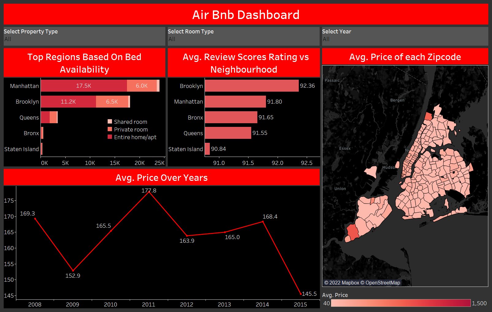

# AirBnb NewYork Analysis

[Dashboard can be viewed here.](https://public.tableau.com/views/airbnbproject_16620422433420/Dashboard1?:language=en-US&:display_count=n&:origin=viz_share_link) 

### Overview
Suppose you wish to visit New York soon and are looking for a place to stay while on your visit or consider another scenario in which you visit to invest in New York real estate and earn rent on your properties. In both these scenarios it is of your best interest to find places with lowest/highest rent.

Using this dashboard we can solve both these problems. Not only can a potential investor look for places with best returns but also how rent changes with bedrooms.

Insights generated:
1.  For a tourist one should look for Airbnbs in Brooklyn and Manhattan as they are not only the highest rated areas but also have good availability.
2. Similarly an investor could look into investing in Bronx, Staten Island as there is very low availability in those areas and hence presents an investment opportunity.
3. From the map we see that southern areas have higher average price so an investor could find more lucrative returns on an investment in these areas.
4. Average Rent Prices are roughly distributed about 160 which could suggest this to be a solid, non-risky investment avenue for the faint hearted investors. However deeper analysis is required to confirm the same.

## Dashboard

